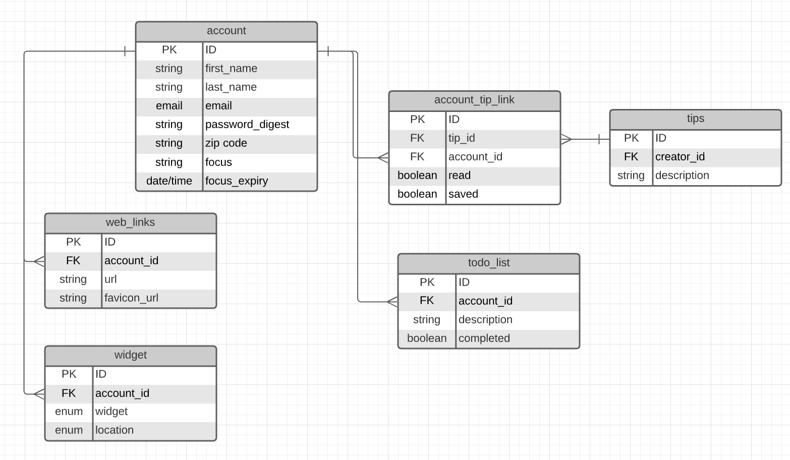

# Make Your Day

#### December 4th, 2020
---
### Contributers

##### Anthony Seth [Github](https://github.com/Anthonyvseth) | [LinkedIn](https://www.linkedin.com/in/anthonyseth/) 

##### Michael Jennings [Github](https://miggymike.github.io/) | [LinkedIn](https://www.linkedin.com/in/mjennings6/) 

##### Michael Z [Github](https://github.com/MikeyZboy) | [LinkedIn](https://www.linkedin.com/in/mikezahuta/) 

##### Ted Fossum [Github](https://github.com/tfossum-bingo) | [LinkedIn](https://www.linkedin.com/in/tedfossum/) 
---


### Overview

Personlized daily organizer to help guide a user through their day. A tool for someone to come to the webiste to get a check in on weather time and major todo's and plans for the day. Having warm welcome for the user to make them feel as if this is another home check in for their busy life.

### Technologies Used

- React
- Psql
- Node
- HMTL/CSS/JavaScript
- Materialize for styling

---

### Demo/Mockup/Wireframes/Live Demo

---

### Getting Started

What you need to install...
Project was deployed on Heroku and can be found [here](link).

---

## Back-end API
.
### Creating an account

Path[POST]: ```localhost:3001/api/accounts```

Request:
``` json
{
	"firstName": "Ted",
	"lastName": "Fossum",
	"email": "ted@mail.com",
	"password": "foo",
	"zipCode": "30004",
	"focus": "creating backend"
}
```
Response:
``` json
{
  "id": 4,
  "firstName": "Logan",
  "lastName": "Fossum",
  "email": "logan@mail.com",
  "password": "foo",
  "zipCode": "30004",
  "focus": "creating backend",
  "updatedAt": "2020-12-05T16:00:49.830Z",
  "createdAt": "2020-12-05T16:00:49.830Z",
  "focusExpiry": null
}
```
### Login
Path[POST]: ```localhost:3001/api/accounts/login```

Request:
``` json
{
	"email": "logan@mail.com",
	"password": "foo"
}
```
Respone:
``` json
{
  "id": 4,
  "firstName": "Logan",
  "lastName": "Fossum",
  "email": "logan@mail.com",
  "password": "foo",
  "zipCode": "30004",
  "focus": "creating backend",
  "focusExpiry": null,
  "createdAt": "2020-12-05T16:00:49.830Z",
  "updatedAt": "2020-12-05T16:00:49.830Z",
  "todos": []
}
```
### Creating a Todo for an account
Note: Todos are created within the context of an account. Therefore the ```api/accounts``` is used when creating the Todo. Further actions use the ```api/todos``` endpoint.

Path[POST]: ```localhost:3001/api/accounts/:id/todos```

Request:
``` json
{
	"description": "This is my first todo",
	"complete": false
}
```
Response:
``` json
{
  "id": 3,
  "accountID": 4,
  "description": "This is my first todo",
  "complete": false,
  "updatedAt": "2020-12-05T16:11:53.241Z",
  "createdAt": "2020-12-05T16:11:53.241Z"
}
```
### Creating a Weblink for an account
Note: Weblinks are created within the context of an account. Therefore the ```api/accounts``` is used when creating the Weblink. Further actions use the ```api/weblinks``` endpoint.

Path[POST]: ```localhost:3001/api/accounts/:id/weblinks```

Request:
``` json
{
	"url": "nodejs.org/",
	"favicon_url": null
}
```
Response:
``` json
{
  "id": 4,
  "accountID": 2,
  "url": "nodejs.org/",
  "updatedAt": "2020-12-05T21:39:57.901Z",
  "createdAt": "2020-12-05T21:39:57.901Z",
  "favicon_url": null
}
```

---
### Future updates / Stretch Goals / Planned Improvements / Post MVP

- [x] auth
- [ ] 3rd party api
- [ ] sockets
- [ ] ui library
- [ ] search bar
- [ ] filter

---

### ERD (Enity Relationship Diagram)




---

### Credits

- imgs from [unsplash](https://miggymike.github.io/) and google.
- Materialize
- Google Fonts